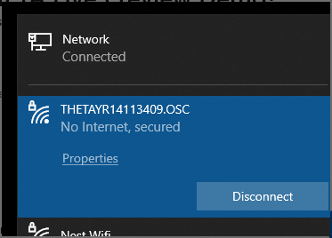
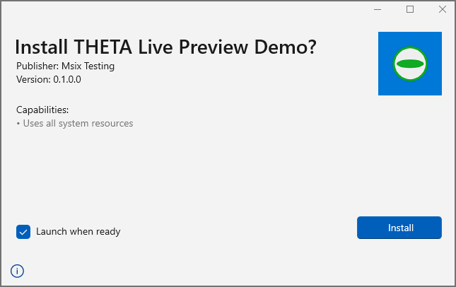

# RICOH THETA X Live Preview Tester


Demonstration of using RICOH THETA API with Flutter

[Longer demonstration showing latency](https://youtu.be/8YXY8XcQNnM).

Windows WiFi must be connected to THETA X.



---

## development

build Windows installer for testing.

`dart run msix:create`

The logo path needs to be adjusted for the build.

```yaml
msix_config:
  display_name: THETA Live Preview Demo
  publisher_display_name: Oppkey
  msix_version: 0.1.0.0
  logo_path: C:\Users\craig\Pictures\theta\community_logo.png
```


